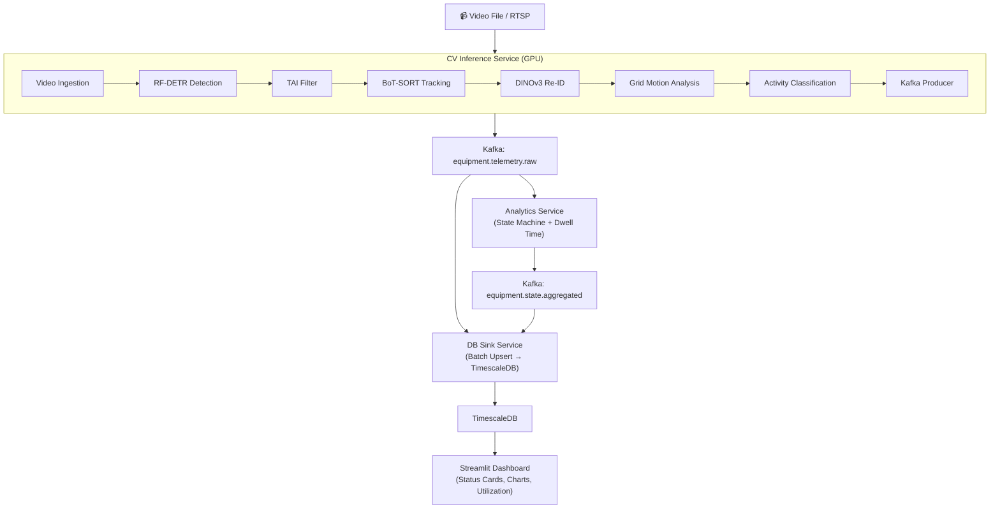

<div align="center">

# 🏗️ SiteSense

### Real-Time Construction Equipment Monitoring via Aerial Computer Vision

[](https://python.org)
[](https://pytorch.org)
[](https://docker.com)
[](https://kafka.apache.org)
[](LICENSE)

**Detect, track, identify, and classify the activity of heavy construction equipment from drone/aerial video footage — in real time.**

</div>

---

## Demo

<div align="center">


*Real-time detection, tracking, identity assignment, and activity classification of construction equipment from aerial footage.*

</div>

---

## Table of Contents

1. [Key Metrics](#key-metrics)
2. [Architecture Overview](#architecture-overview)
3. [CV Pipeline Deep Dive](#cv-pipeline-deep-dive)
4. [Analytics Backend](#analytics-backend)
5. [Data Persistence & Dashboard](#data-persistence--dashboard)
6. [Training Infrastructure](#training-infrastructure)
7. [Design Decisions & Trade-offs](#design-decisions--trade-offs)
8. [Quick Start](#quick-start)
9. [Project Structure](#project-structure)
10. [Known Limitations](#known-limitations)

---

## Key Metrics

| Metric | Value |
|:---|:---:|
| **mAP@50:95** | **0.761** |
| **mAP@50** | **0.910** |
| **F1 Score** | **0.886** |
| **Precision** | **0.929** |
| **Recall** | **0.847** |
| **Equipment Classes** | **8** |
| **Pipeline FPS** | **9–10** (RTX 3050 Ti) |

<details>
<summary><strong>Per-Class Detection Results</strong></summary>

| Class | AP@50:95 | F1 | Precision | Recall |
|:---|:---:|:---:|:---:|:---:|
| Excavator | 0.811 | 0.933 | 0.964 | 0.904 |
| Dump Truck | 0.675 | 0.847 | 0.910 | 0.792 |
| Bulldozer | 0.785 | 0.899 | 0.926 | 0.874 |
| Wheel Loader | 0.810 | 0.906 | 0.935 | 0.878 |
| Mobile Crane | 0.675 | 0.817 | 0.878 | 0.764 |
| Tower Crane | 0.692 | 0.839 | 0.904 | 0.782 |
| Roller Compactor | 0.838 | 0.925 | 0.953 | 0.899 |
| Cement Mixer | 0.800 | 0.922 | 0.965 | 0.882 |

</details>

---

## Architecture Overview

The system is a fully containerized, event-driven microservices pipeline orchestrated by Docker Compose. All inter-service communication flows through Apache Kafka, ensuring loose coupling and replay capability.



### Services & Infrastructure (7 Containers)

| Component | Technology | Why This Technology | Role |
|:---|:---|:---|:---|
| **Kafka (KRaft)** | Confluent CP 7.6.0 | KRaft eliminates ZooKeeper — fewer containers, simpler ops. Two topics: `equipment.telemetry.raw` (append-only) and `equipment.state.aggregated` (compacted) | Message broker |
| **TimescaleDB** | PostgreSQL 16 + TimescaleDB | Hypertables auto-partition by time, continuous aggregates pre-compute rollups, retention policies auto-prune. Chosen over InfluxDB for relational query support (JOINs, DISTINCT ON) | Time-series data sink |
| **CV Inference** | Python 3.11, CUDA 12.4, PyTorch 2.2+ | `torch.compile` and native bfloat16 support for DINOv3 backbone | GPU pipeline |
| **Analytics** | Python 3.11, confluent-kafka | Separated from CV for independent scaling. `confluent-kafka` (librdkafka C wrapper) for 10× throughput over `kafka-python` | State machine |
| **DB Sink** | Python 3.11, psycopg2 | CPU-bound analytics vs I/O-bound DB writes — independent failure domains | Batch upsert writer |
| **Dashboard** | Streamlit 1.x, Plotly | Full dashboard in a single Python file with no frontend build step | Real-time UI |

---

## CV Pipeline Deep Dive

The CV inference service (`services/cv-inference/main.py`) processes each video frame through 12 sequential phases:

### Phase 1: Video Ingestion

A dedicated `VideoIngestionService` runs a **background producer thread** that continuously decodes frames and pushes `FramePacket` objects into a thread-safe bounded queue.

**Why threaded?** Video decoding (CPU-bound) and GPU inference run at different speeds. The producer pre-decodes frames so the GPU always has work ready — eliminating I/O stalls.

- **Backpressure**: For RTSP streams, oldest frames are dropped when the queue is full; for files, the thread blocks — no frames lost
- **Frame metadata**: Each packet carries `frame_id`, `timestamp` (from source FPS), and `source_id`
- **Frame skipping**: Configurable `frame_skip` to reduce GPU load at 60 FPS sources
- Supports MP4, AVI, MKV files and RTSP/HTTP live streams

### Phase 2: Object Detection — RF-DETR

**Model**: RF-DETR (Real-time Foundation Detection Transformer), an end-to-end object detector that eliminates NMS post-processing.

**Why RF-DETR over YOLO?** On construction sites, equipment frequently occupies overlapping bounding boxes — a wheel loader scooping from a dump truck, an excavator swinging its arm over a parked bulldozer. YOLO-family detectors use NMS which can *silently suppress valid detections* when boxes overlap above an IoU threshold. RF-DETR uses set-based prediction (Hungarian matching) — one prediction per object with no post-processing.

**Training Dataset**: Two complementary public sources merged into a unified 8-class dataset:
- **MOCS** (41,668 images) — largest construction equipment dataset, strong for excavators and dump trucks
- **ACID v2** (23,801 images) — Roboflow-curated with aerial/drone perspectives

The merge script maps heterogeneous class names (e.g., `"Loader"`, `"wheel_loader"`, `"Wheel Loader"` all → class 3) and applies dominance-weighted oversampling to balance underrepresented classes to ≥40% of the max class count.

<details>
<summary><strong>Training Hyperparameters</strong></summary>

- **Combined dataset**: ~65,000 images (42,733 train / 4,615 val / 990 test)
- **Classes**: excavator, dump_truck, bulldozer, wheel_loader, mobile_crane, tower_crane, roller_compactor, cement_mixer
- **Resolution**: 784px (max divisible by 56 for ViT patch size)
- **Epochs**: 40, batch size 40, cosine LR with 2-epoch warmup
- **Regularization**: drop path 0.1, weight decay 1e-4, early stopping patience 15
- **Speed**: cuDNN benchmark, TF32 matmuls, persistent workers

</details>

### Phase 2.5: Detection Filtering

Two filters suppress noise before tracking:

1. **TAI Filter (Track-Aware Initialization)**: Suppresses fragment detections (e.g., bucket-only) that overlap heavily (IoA > 0.4) with existing tracks. Uses IoA instead of IoU because fragment boxes have small area — IoU would miss them.

2. **Min-Area Filter**: Removes detections < 0.3% of frame area. Distant background vehicles are consistently smaller than this threshold.

### Phase 3: Multi-Object Tracking — BoT-SORT

**Why BoT-SORT?** Construction equipment tracking has three challenges that simpler trackers can't handle: (1) **camera motion** from drone pan/tilt, (2) **long occlusions** behind other equipment, (3) **visual similarity** between same-type machines.

BoT-SORT combines Kalman filtering, IoU matching, OSNet Re-ID, and **ECC camera motion compensation** — the CMC module is essential for drone footage.

| Parameter | Value | Rationale |
|:---|:---:|:---|
| `track_buffer` | 600 | 20-second track retention (at 60 FPS) |
| `match_thresh` | 0.85 | Prevents merging nearby machines |
| `cmc_method` | ECC | Robust affine compensation for aerial footage |
| `appearance_thresh` | 0.4 | Permissive — OSNet's construction discrimination is limited |

### Phase 4: Re-Identification — DINOv3 Gallery

When BoT-SORT drops a track, the equipment's visual identity is preserved in a **Re-ID gallery** powered by DINOv3 ViT-B/16.

**Why DINOv3 on top of OSNet?** OSNet was trained on pedestrians (MSMT17) — it doesn't discriminate well between a CAT 992C and a Komatsu WA380. DINOv3's self-supervised pretraining on 1.7B images provides rich features that transfer to construction equipment with minimal fine-tuning.

**Architecture**: Frozen DINOv3 backbone → CLS+mean(patches) [1536-d] → 3-layer MLP projection head → L2-normalized 128-d embedding

```
DINOv3 ViT-B/16 (frozen, bfloat16) → CLS + mean(patches) [1536-d]
  → Linear(1536, 768) → BN → GELU → Dropout(0.1)
  → Linear(768, 256)  → BN → GELU → Dropout(0.1)
  → Linear(256, 128)  → L2-normalize
```

**Gallery Matching** uses a combined score:
```
final_score = α × visual_similarity + (1 − α) × spatial_similarity
```
- α increases with time lost — position is reliable immediately after loss; visual similarity dominates after 10+ seconds
- Match accepted only if `final_score ≥ 0.85` and `visual_similarity ≥ 0.50`

**Equipment ID System**: Class-prefixed IDs (`EX-001`, `WL-002`, `DT-001`), deferred creation (30 frames = 0.5s persistence required), temporal buffers indexed by `equip_id` to persist history across tracker drops.

### Phase 5: Articulated Motion Detection

Construction equipment like excavators can be **actively working while most of the body remains stationary** — only the arm moves. Traditional whole-object motion analysis fails here.

**Solution**: `ArticulatedMotionDetector` decomposes each bounding box into a **3×3 spatial grid** and analyzes per-region optical flow.

```
┌─────────┬─────────┬─────────┐
│ Cell 0,0│ Cell 0,1│ Cell 0,2│  ← Top: bucket elevated (dump)
├─────────┼─────────┼─────────┤
│ Cell 1,0│ Cell 1,1│ Cell 1,2│  ← Middle
├─────────┼─────────┼─────────┤
│ Cell 2,0│ Cell 2,1│ Cell 2,2│  ← Bottom: bucket low (dig)
└─────────┴─────────┴─────────┘
```

- **Farneback Dense Optical Flow** at < 2ms per 300×300 crop
- **Dual-gate detection**: localized motion (top_5% − median > 0.3) OR absolute flow (top_5% > 0.35)
- **Asymmetric hysteresis**: fast attack (3/15 frames) → slow decay (8/60 frames) to hold through intra-cycle pauses
- **Centroid displacement**: catches translating vehicles with uniform pixel-level flow

### Phase 6: Activity Classification

Determines specific work activity: **DIGGING**, **LOADING**, **DUMPING**, or **WAITING**.

#### Active: Rule-Based Bucket Height + Spatial Context

Three-pass approach for different equipment types:

**Articulated Equipment** (excavators, wheel loaders, bulldozers):
```python
bucket_height_score = (top_flow − bottom_flow) / total_flow
```

| Condition | Activity |
|:---|:---|
| INACTIVE | WAITING |
| ACTIVE + whole_body + score < -0.15 | DIGGING |
| ACTIVE + whole_body + score ≥ -0.15 | LOADING |
| ACTIVE + partial + score > 0.1 | DUMPING |
| ACTIVE + partial + score ≤ 0.1 | DIGGING |

**Dump Trucks** — classified via spatial context (proximity to active articulated machines).

**Temporal Smoothing**: Majority vote over 0.5s window with binary gate (ACTIVE/INACTIVE first, then sub-state).

#### Planned: X3D-S Video Classifier

Infrastructure fully built — awaiting labeled dataset (~500 clips per class):
1. `scripts/extract_activity_clips.py` extracts 16-frame cropped clips
2. `training/train_activity_classifier.py` implements two-phase fine-tuning
3. Pipeline auto-detects and loads the model if `weights/activity_classifier_x3d_s.pt` exists

### Phase 7: Kafka Telemetry Production

Each tracked equipment generates a JSON event per frame:

```json
{
  "frame_id": 450,
  "equipment_id": "WL-001",
  "equipment_class": "wheel_loader",
  "timestamp": "00:00:15.000",
  "bbox": {"x1": 120.5, "y1": 80.2, "x2": 450.8, "y2": 380.1},
  "detection_confidence": 0.92,
  "utilization": {
    "current_state": "ACTIVE",
    "current_activity": "DIGGING",
    "motion_source": "whole_body"
  }
}
```

### Phase 8: Annotated Video Output

Color-coded bounding boxes, equipment IDs, state labels, and a HUD overlay (timestamp, tracked count, FPS) rendered to `data/output_annotated.mp4` at source FPS.

---

## Analytics Backend

The analytics service (`services/analytics/main.py`, 412 lines) maintains a per-equipment **hysteresis-based state machine**:

```
         ┌─────────────────────────────┐
         │                             │
    ┌────▼────┐    10 frames    ┌──────┴────┐
    │  ACTIVE │◄──────────────► │  INACTIVE │
    └────┬────┘    confirmed    └──────┬────┘
         │                             │
         │     Track lost              │ Track lost
         └──────────┐ ┌────────────────┘
                    ▼ ▼
              ┌──────────────┐
              │  SUSPENDED   │  (timers continue on
              └──────────────┘   last known state)
```

- **10-frame hysteresis** — filters single-frame classification noise (~167ms confirmation window)
- **SUSPENDED state** — timers continue counting on last known state during occlusions (equipment doesn't stop working because dust blocks the camera)
- **Delta-based dwell time** — FPS-independent; `utilization_% = total_active / total_tracked × 100`
- **State change events** published to compacted Kafka topic with duration, cumulative active/idle time, and utilization percentage

---

## Data Persistence & Dashboard

### TimescaleDB Schema

Two hypertables auto-partitioned by time (daily chunks):
- `equipment_telemetry` — raw per-frame events with upsert idempotency (`ON CONFLICT DO UPDATE`)
- `equipment_state_changes` — confirmed transitions (rare events, fast queries)

**Continuous aggregate** (`equipment_utilization_1min`) pre-computes per-minute rollups for dashboard queries — incremental materialization avoids full table scans.

### DB Sink Service

Batch upserts (100 rows/transaction, 1s flush timeout) with transaction-safe rollback. Consumes both Kafka topics simultaneously.

### Streamlit Dashboard

Premium dark-theme UI with:
- Equipment status cards (live state, utilization bars, activity labels)
- Plotly time-series charts (utilization % with 70% target line)
- Activity distribution (stacked bar per equipment)
- Anomaly alerts (idle > 15 minutes)
- State change log (last 20 transitions)
- Auto-refresh (5–60s configurable)

---

## Training Infrastructure

All training scripts are in `training/` and designed to run on any GPU with 40GB+ VRAM.

### Detection Model — `train_detector.py`

```bash
python training/train_detector.py
```

RF-DETR Base fine-tuned on merged MOCS + ACID dataset:
- 40 epochs, 784px, cosine LR, early stopping
- **Result**: mAP@50:95 = **0.761**, mAP@50 = **0.910**, F1 = **0.886**

### Re-ID Projection Head — `train_reid.py`

```bash
python training/train_reid.py
```

Contrastive learning (SimCLR-style) on equipment crops:
- Frozen DINOv3 backbone + 3-layer MLP trained with NT-Xent loss (τ=0.07)
- 20 epochs, batch 128, AdamW + cosine annealing, bfloat16 mixed-precision
- Heavy geometric augmentation simulating aerial viewpoint changes
- **Output**: `dinov3_reid_head.pth` (5.4 MB)

### Activity Classifier — `train_activity_classifier.py` *(In Progress)*

```bash
python training/train_activity_classifier.py
```

X3D-S (Kinetics-400 pretrained, 3.8M params) with two-phase fine-tuning:
- Phase 1: frozen backbone, head-only training
- Phase 2: full fine-tune with lower LR
- **Status**: Awaiting labeled dataset (~500 clips per class)

---

## Design Decisions & Trade-offs

<details>
<summary><strong>Why RF-DETR over YOLO?</strong></summary>

RF-DETR's set-based prediction (Hungarian matching) is architecturally superior to YOLO's anchor-based + NMS paradigm for densely overlapping equipment. Trade-off: 9–10 FPS vs ~15+ FPS with YOLOv11 — acceptable for utilization monitoring where accuracy > frame rate.
</details>

<details>
<summary><strong>Why Grid Decomposition over Instance Segmentation?</strong></summary>

Instance segmentation (Mask R-CNN) would provide precise boundaries but at significant compute cost. The 3×3 grid achieves the same functional outcome — detecting arm-only vs whole-body motion — at a fraction of the cost.
</details>

<details>
<summary><strong>Why Centroid Displacement + Optical Flow?</strong></summary>

Each signal alone has blind spots: optical flow misses translating vehicles (uniform motion), centroid displacement misses articulated motion (stationary bounding box). Combined = no blind spots.
</details>

<details>
<summary><strong>Why Asymmetric Hysteresis?</strong></summary>

Construction equipment works in repetitive cycles with brief pauses (0.5–2s). Fast-attack / slow-decay: starts active within ~3 frames of motion, stays active through intra-cycle pauses, only goes inactive after sustained absence.
</details>

<details>
<summary><strong>Why DINOv3 Contrastive Re-ID?</strong></summary>

Standard DINOv3 does category-level recognition (all wheel loaders look similar). Contrastive training pushes embeddings toward instance-level discrimination. We approximate identity labels using heavily augmented views of the same crop as positive pairs.
</details>

<details>
<summary><strong>Why Kafka over Direct Function Calls?</strong></summary>

Independent scaling, message replay (for model upgrades), fault tolerance (Kafka buffers if DB is down), multi-consumer support (analytics + DB sink + future alerting from the same stream).
</details>

<details>
<summary><strong>Why Stable equip_id for Temporal Buffers?</strong></summary>

Originally indexed by transient `track_id` — state reset every time the tracker dropped and re-acquired. Indexing by `equip_id` (Re-ID confirmed identity) persists history across tracker drops.
</details>

---

## Quick Start

### Prerequisites

- Docker & Docker Compose v2
- NVIDIA GPU with CUDA 12.x drivers
- [NVIDIA Container Toolkit](https://docs.nvidia.com/datacenter/cloud-native/container-toolkit/install-guide.html)
- ~15 GB disk space

### 1. Clone & Configure

```bash
git clone https://github.com/Mahmoud-Zaafan/SiteSense.git
cd SiteSense

cp .env.example .env
# Edit .env with your HF_TOKEN and database credentials
```

### 2. Download Model Weights

Download all weights from [Hugging Face Hub](https://huggingface.co/Zaafan/sitesense-weights) into the `models/` directory:

```bash
pip install huggingface_hub
huggingface-cli download Zaafan/sitesense-weights --local-dir models/
```

| File | Size | Description |
|:---|:---:|:---|
| `rfdetr_construction.pth` | 122 MB | RF-DETR detector (8-class) |
| `dinov3_reid_head.pth` | 5.4 MB | DINOv3 Re-ID projection head |
| `osnet_x0_25_msmt17.pt` | 2.9 MB | OSNet Re-ID (BoT-SORT built-in) |

> The DINOv3 backbone (`dinov3-vitb16-pretrain-lvd1689m/`) is auto-downloaded from Hugging Face on first run using your `HF_TOKEN`.

### 3. Launch Infrastructure

```bash
docker compose up --build
```

### 4. Run the CV Pipeline

```bash
cp your_video.mp4 data/test_video.mp4
docker compose --profile pipeline up cv-inference
```

### 5. View Results

- **Dashboard**: http://localhost:8505
- **Annotated Video**: `data/output_annotated.mp4`

> The CV pipeline uses a Docker Compose [profile](https://docs.docker.com/compose/profiles/) — it doesn't auto-start with `docker compose up`, letting you restart infrastructure without re-processing.

### Environment Variables

| Variable | Default | Description |
|:---|:---|:---|
| `VIDEO_SOURCE` | `/data/test_video.mp4` | Input video path (inside container) |
| `DEVICE` | `cuda` | Inference device |
| `CONFIDENCE_THRESHOLD` | `0.35` | Detection confidence cutoff |
| `REID_USE_PROJECTION` | `1` | Enable DINOv3 contrastive projection head |
| `REID_THRESHOLD` | `0.85` | Re-ID gallery matching threshold |
| `HF_TOKEN` | — | Hugging Face token for DINOv3 download |

---

## Project Structure

```
sitesense/
├── assets/
│   └── demo.gif                         # README demo
├── configs/
│   ├── botsort.yaml                     # BoT-SORT tracker config
│   └── botsort_construction.yaml        # Construction-tuned tracker
├── data/                                # Input/output videos (gitignored)
├── docs/
│   └── technical_assessment.md          # Original project specification
├── models/                              # Model weights (gitignored)
│   ├── rfdetr_construction.pth          # RF-DETR detector (122 MB)
│   ├── dinov3_reid_head.pth             # Re-ID projection head (5.4 MB)
│   ├── osnet_x0_25_msmt17.pt            # OSNet for BoT-SORT (2.9 MB)
│   └── dinov3-vitb16-pretrain-lvd1689m/ # DINOv3 backbone (327 MB)
├── scripts/
│   ├── init.sql                         # TimescaleDB schema
│   ├── extract_activity_clips.py        # Dataset extraction for X3D-S
│   └── extract_youtube_frames.py        # Frame extraction utility
├── services/
│   ├── cv-inference/                    # GPU inference pipeline
│   │   ├── main.py                      # 12-phase CV pipeline
│   │   ├── ingestion.py                 # Threaded video reader
│   │   ├── Dockerfile
│   │   └── requirements.txt
│   ├── analytics/                       # State machine + utilization
│   │   ├── main.py
│   │   └── Dockerfile
│   ├── db-sink/                         # Kafka → TimescaleDB writer
│   │   ├── main.py
│   │   └── Dockerfile
│   └── dashboard/                       # Streamlit real-time UI
│       ├── app.py
│       └── Dockerfile
├── training/
│   ├── train_detector.py                # RF-DETR fine-tuning
│   ├── train_reid.py                    # DINOv3 contrastive head
│   ├── train_activity_classifier.py     # X3D-S classifier
│   └── visualize_reid.py               # Re-ID embedding visualization
├── docker-compose.yml                   # 7-container orchestration
├── .env.example                         # Environment template
└── README.md
```

---

## Known Limitations

1. **Same-class identity confusion**: DINOv3 Re-ID can occasionally match different vehicles of the same type (two yellow dump trucks) to the same equipment ID. The strict combined threshold (0.85) mitigates but doesn't eliminate this.

2. **Activity classification granularity**: Rule-based optical flow works well for clear scenarios but is coarser for subtle transitions. X3D-S upgrade (in progress) will learn patterns from data.

3. **Single-camera**: Current pipeline processes one video source. Multi-camera fusion would require cross-camera Re-ID and spatial registration.

4. **Fixed grid partitioning**: The 3×3 grid assumes roughly consistent equipment orientation. Equipment viewed from unusual angles may have misaligned bucket/body regions.

5. **GPU requirement**: Pipeline requires NVIDIA GPU with CUDA 12.x; no CPU-only mode.

---

## License

MIT License — see [LICENSE](LICENSE) for details.
